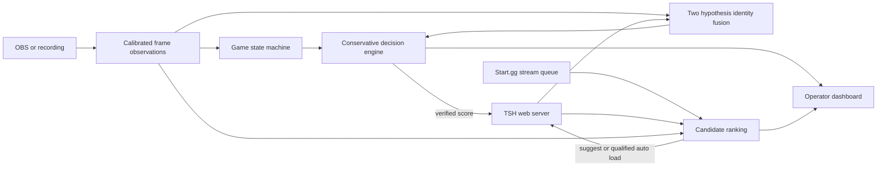

# Smash AutoScore

A local broadcast controller for Super Smash Bros. Ultimate tournaments. It helps operators keep Tournament Stream Helper (TSH) scores and player names current when in game tags may be unrelated to bracket names.

For a complete feature inventory, validation status, and prioritized remaining work, see the [project status write-up](docs/project-status.md).

## Quick setup

1. Open Tournament Stream Helper (TSH) and load a disposable two-player set for testing.
2. Open OBS and enable **Tools → WebSocket Server Settings → Enable WebSocket server** if needed.
3. Start AutoScore with `python -m uvicorn smash_auto_score.app:app --host 127.0.0.1 --port 8765`.
4. Open `http://127.0.0.1:8765/setup`. Discover local services, choose the correct TSH and OBS source, review its frame, and run full read-only validation.
5. Start **shadow rehearsal**. Compare its would-be scores with a real set before arming automatic scoring in the dashboard.

The wizard discovers local TSH ports (including 5500 used by the installed copy), OBS WebSocket ports, scenes, and capture inputs. It saves selected settings in ignored `.env` and applies them to the running app. The operator may still need to provide the OBS WebSocket password, a [Start.gg personal API token](https://developer.start.gg/docs/authentication/) from account Developer Settings, a tournament URL if TSH has none, and a choice among ambiguous sources or streams. Start.gg is optional. The setup page never runs a TSH write during discovery or full validation. Its separate disposable score test explicitly changes one point, reads it back, restores it, and verifies restoration; run it only on a disposable set. The local check command is `python -m smash_auto_score.integration_check`.

If TSH reports `./user_data/settings.json` missing while the file exists beside `TSH.exe`, launch the EXE with its extracted folder as the working directory. The current machine's TSH web server was reachable on `127.0.0.1:5500`, but it had no loaded two-player set during this setup work. OBS was not running and no Start.gg token was configured, so the current machine is **not ready for rehearsal** yet. See [setup validation details](docs/setup.md).

## Safety model

Auto score starts **disarmed**. Next set mode starts at **SUGGEST**. An automatic point requires a confirmed game end, a slot winner above the winner threshold, and a two hypothesis player mapping above the mapping threshold. Conflicting evidence caps mapping confidence. If a TSH write cannot be verified, automation disarms and the transaction is marked uncertain for operator review. A game generation and persisted event ID prevent duplicate points while an end screen remains visible. Undo checks the current set and expected score before reversing a transaction.

After set completion, candidate refresh waits 15 seconds by default. AUTO set loading additionally requires fresh active game observations after that delay, plus the configured confidence and margin. The operator can dismiss a suggestion for the current set.

The winner detector now uses the first-place results layout seen in the supplied Ultimate footage. It checks a gold placement region, a red or blue first-place slot badge, and the opposite-colored second-place badge. Two matching samples are required for both game-end confirmation and winner identification. Winner identity is only `P1` or `P2`; the mapping engine translates that slot to the competitor. A partial or conflicting layout yields unknown and leaves manual scoring available. Explicit OCR win text remains an optional fallback. Automation still starts disarmed. The supplied footage is one broadcast layout, so this is not evidence of tournament readiness on other overlays or aspect ratios.

## Architecture



The two mapping hypotheses are `P1 = TSH left` and `P1 = TSH right`. Tag, HUD color, character history, and previous mapping provide separate evidence. One strong tag can map both players. Random tags provide no identity evidence and do not block other signals. The game state machine requires stable gameplay HUD observations before starting a game, confirms results temporally, and locks a scored game until fresh gameplay and the post-game lockout permit another generation. The persisted score event ID also prevents duplicate writes.

## Install and run

Python 3.12 or newer is required. Python 3.14 was used for local validation.

```powershell
python -m venv .venv
.venv\Scripts\Activate.ps1
python -m pip install -e '.[dev]'
Copy-Item .env.example .env
python -m uvicorn smash_auto_score.app:app --host 127.0.0.1 --port 8765
```

Open `http://127.0.0.1:8765`. `SAS_DEMO=true` uses an in memory TSH mock with DjDickCheese vs Snackz, red and blue HUD colors, and a next set. The dashboard supports manual point entry, undo, mapping override, set suggestion, set load, and reset. Use `POST /api/replay/observation` in demo mode to replay structured observations.

## OBS configuration

Enable OBS WebSocket 5.x, set its password, and configure `SAS_OBS_HOST`, `SAS_OBS_PORT`, `SAS_OBS_PASSWORD`, and `SAS_OBS_SOURCE` with the capture source name. `GetSourceScreenshot` supplies downscaled frames. `SAS_FRAME_FPS`, `SAS_OCR_INTERVAL`, and `SAS_COLOR_INTERVAL` control independent sampling rates. For a recording, set `SAS_RECORDED_VIDEO` to a local video path. The video worker reconnects after source errors and reports connection status on the dashboard.

## TSH configuration

Set `SAS_DEMO=false`, `SAS_TSH_URL`, and `SAS_TSH_SCOREBOARD`. The adapter targets the local web server routes in joaorb64 TournamentStreamHelper 5.x: scoreboard get, get set, score up/down, swap teams, get sets, and load set. These routes are implementation details rather than a versioned public API. Verify behavior against the installed TSH version in a rehearsal before connecting a live broadcast. No live TSH instance was available during development.

## Start.gg and Supermajor

TSH supplies candidate sets. Optionally set `SAS_STARTGG_TOKEN`, `SAS_STARTGG_TOURNAMENT_SLUG`, and `SAS_STARTGG_STREAM_NAME` to add the official Start.gg GraphQL stream queue as a strong assignment signal. Without these values, the candidate ranker uses observations and TSH candidates only. No live Start.gg credentials were available for validation.

Supermajor enrichment is optional. Set `SAS_SUPERMAJOR_ENABLED=true`, then enter a verified Supermajor player ID such as `S222927` in the dashboard. The provider reads the public [player overview page](https://www.supermajor.gg/ultimate/player/_?id=S222927) on demand. It parses the page's embedded structured data; this is an undocumented page format, not an official API. A changed format, invalid ID, missing page, or network failure yields no evidence. Start.gg IDs are **not** assumed to be Supermajor IDs. The dashboard shows lookup status, canonical name, reported character distribution, and errors. The manual Refresh button bypasses the seven day SQLite cache. Requests have a timeout and at most two run concurrently.

Character probabilities are calculated only from reported `num_games` counts. The last six months are used when they contain at least `SAS_SUPERMAJOR_MIN_GAMES` (default 20) reported games; otherwise all time is used if sufficient. If neither is sufficient, the distribution is empty. Supermajor [describes its character data and limitations](https://www.supermajor.gg/articles/dev-build-update-2024-08-28); unreported games and fallback main labels are excluded here. A saved local override wins over public data. If an ID comes from anything other than explicit operator entry and the page name differs, the provider marks it ambiguous. Public page access was verified on 2026-10-02; live service behavior may change.

## Calibration

The dashboard calibration card displays the latest frame. Create named profiles, drag rectangles for tag, HUD, character, gameplay, game set, result, and winner regions, and save. Coordinates are normalized and stored at `SAS_CALIBRATION_PATH`. Tesseract OCR must be installed separately and available on `PATH` for text detection. Test crops against actual footage, overlays, transition screens, and different stages before arming automation. The current generic gameplay detector uses image variance and is experimental; winner association requires explicit slot text in its own region.

For characters, draw tight `p1_character` and `p2_character` rectangles around the HUD portraits, excluding damage numbers and stage background where possible. With a gameplay frame visible, use **Character templates** to save a named crop for that slot. Capture a few examples per character under different stages or visual effects. Templates are local PNGs in `SAS_CHARACTER_TEMPLATE_PATH` (default `config/character_templates`) and are ignored by Git. Recognition compares normalized gray portraits with local templates, requires an absolute match and a margin over the next character, and needs three agreeing observations in a five-sample window. Unknown, missing, or ambiguous crops yield no character. History clears on game generation changes. Detection runs independently of OCR at `SAS_CHARACTER_INTERVAL` (default 0.5 seconds). Character history alone is capped at 90% mapping confidence, below the 95% default mapping gate.

To replay a recording, run:

```powershell
python -m smash_auto_score.analyze_video 'C:\path\to\recording.mp4' --start 779 --end 1250 --step 5 --output diagnostics/characters.csv
```

The CSV lists the stable detected character or `unknown` per slot and sample. Inspect transitions and any wrong labels, then adjust regions/templates before using the observations. On the supplied 1920×1080 recording, local templates captured at 13:20 and 16:00 were replayed at 10-second intervals from 13:20 to 20:00. Before the character switch, the detector labeled Donkey Kong in 6/11 P1 samples and Little Mac in 8/11 P2 samples. After the switch, it labeled Donkey Kong in 21/25 P1 samples and Joker in 17/25 P2 samples. The remaining samples were `unknown`; all ten portrait observations from 15:10 to 15:50 were unknown during the transition. There were no wrong labels among these 72 pre/post portrait samples. This is one broadcast layout with three character templates, not validation across the full roster or other layouts.

### Game-end and winner replay

The result detector uses three normalized regions: `placement`, `winner_badge`, and `loser_badge`. Defaults are calibrated to the supplied 16:9 recording; adjust them in the dashboard for another capture. The first-place and second-place badges must disagree in color before a winner is reported. This slot-based method also works for dittos without relying on character identity. Final-stock tracking was investigated but is not used as a scoring signal because stock icons are often obscured. Timeout endings remain unvalidated.

```powershell
python -m smash_auto_score.analyze_video 'C:\path\to\recording.mp4' --mode games --start 00:14:50 --end 00:15:15 --step 0.2 --output diagnostics/games.json
```

The command writes JSON and CSV game summaries. At 5 FPS, three labeled windows in the supplied recording ended at 15:07.4 (P1), 20:49.6 (P1), and 44:58.6 (P2). All three known ends were detected and all three winner slots were correct; there were zero wrong winners and zero extra end events in those 85 seconds of selected windows. Confirmation took about 0.2 seconds after the first qualifying result frame. At 2.5 FPS, the brief 20:49 result was missed. In a 35-second offline P2 replay, average CV processing was 2.06 ms/frame (winner logic 0.71 ms), process RAM was 76.7 MB, and process CPU averaged 341.5% of one core; random video seeks and decode dominate that CPU figure. Live OBS and TSH performance has not been measured. These are three selected games, not a broad accuracy estimate. Local PNG templates and replay outputs are ignored by Git.

Set `SAS_WINNER_DIAGNOSTICS_ENABLED=true` to collect candidate, confirmed, result, unknown, and manually labeled frames plus calibrated crops and JSON evidence in `diagnostics/winner`. A manual score that disagrees with a predicted mapped winner logs `winner_prediction_error`. The dashboard shows end/winner evidence, mapped competitor, score gate, and lightweight performance measurements. `SAS_GAME_END_CONFIRMATION_FRAMES`, `SAS_WINNER_CONFIRMATION_FRAMES`, `SAS_NEW_GAME_CONFIRMATION_FRAMES`, and `SAS_POST_GAME_LOCKOUT_SECONDS` tune temporal behavior. [The rehearsal checklist](docs/rehearsal.md) covers live TSH/OBS verification and failure cases.

## Tests and development

```powershell
python -m pytest -q
python -m ruff check src tests
python -m mypy src/smash_auto_score --ignore-missing-imports
```

SQLite stores score transactions and event logs. Tests cover mapping, state transitions, winner layouts, duplicate prevention, score undo, Supermajor failure behavior, TSH route mocks, OBS screenshots, and disconnects. Mock tests do not prove compatibility with an installed TSH or OBS version. No running local TSH or OBS instance was available for this milestone. Do not arm automatic scoring at a live event before a full rehearsal on its actual capture layout.

## Roadmap

1. Label more winner footage across stages, skins, overlays, SDs, and timeouts; measure abstention and false decisions on a held-out set.
2. Test the TSH adapter on the installed version with a disposable scoreboard and document route differences.
3. Rehearse OBS capture, disconnect/reconnect, score verification, undo, set completion, and next-set loading end to end.
4. Expand character templates and candidate ranking only after the scoring path is validated.

## Integration references

- [Tournament Stream Helper source](https://github.com/joaorb64/TournamentStreamHelper), including its local web routes in `src/TSHWebServer.py` and actions in `src/TSHWebServerActions.py`.
- [OBS WebSocket 5 protocol](https://github.com/obsproject/obs-websocket/blob/master/docs/generated/protocol.md).
- [Start.gg stream queue query](https://developer.start.gg/docs/examples/queries/stream-queue/) and [GraphQL request format](https://developer.start.gg/docs/sending-requests/).
