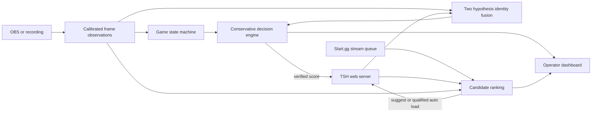

# Smash AutoScore

A local broadcast controller for Super Smash Bros. Ultimate tournaments. It helps operators keep Tournament Stream Helper (TSH) scores and player names current when in game tags may be unrelated to bracket names.

## Safety model

Auto score starts **disarmed**. Next set mode starts at **SUGGEST**. An automatic point requires a confirmed game end, a slot winner above the winner threshold, and a two hypothesis player mapping above the mapping threshold. Conflicting evidence caps mapping confidence. If a TSH write cannot be verified, automation disarms and the transaction is marked uncertain for operator review. A game generation and persisted event ID prevent duplicate points while an end screen remains visible. Undo checks the current set and expected score before reversing a transaction.

The winner detector accepts only explicit `P1 WINS` or `P2 WINS` text in a calibrated winner region at very high OCR confidence. Typical Smash result screens may not show that text, so out of the box auto score remains inert while manual scoring and replayed observations work. This is a functioning operator MVP and detection framework, not a claim of fully autonomous broadcast scoring.

## Architecture



The two mapping hypotheses are `P1 = TSH left` and `P1 = TSH right`. Tag, HUD color, character history, and previous mapping provide separate evidence. One strong tag can map both players. Random tags provide no identity evidence and do not block other signals.

## Install and run

Python 3.12 or newer is required. Python 3.14 was used for local validation.

```powershell
python -m venv .venv
.venv\Scripts\Activate.ps1
python -m pip install -e '.[dev]'
Copy-Item .env.example .env
python -m uvicorn smash_auto_score.app:app --host 127.0.0.1 --port 8765
```

Open `http://127.0.0.1:8765`. `SAS_DEMO=true` uses an in memory TSH mock with DjDickCheese vs Snackz, red and blue HUD colors, and a next set. The dashboard supports manual point entry, undo, mapping override, set suggestion, set load, and reset. Use `POST /api/replay/observation` in demo mode to replay structured observations.

## OBS configuration

Enable OBS WebSocket 5.x, set its password, and configure `SAS_OBS_HOST`, `SAS_OBS_PORT`, `SAS_OBS_PASSWORD`, and `SAS_OBS_SOURCE` with the capture source name. `GetSourceScreenshot` supplies downscaled frames. `SAS_FRAME_FPS`, `SAS_OCR_INTERVAL`, and `SAS_COLOR_INTERVAL` control independent sampling rates. For a recording, set `SAS_RECORDED_VIDEO` to a local video path. The video worker reconnects after source errors and reports connection status on the dashboard.

## TSH configuration

Set `SAS_DEMO=false`, `SAS_TSH_URL`, and `SAS_TSH_SCOREBOARD`. The adapter targets the local web server routes in joaorb64 TournamentStreamHelper 5.x: scoreboard get, get set, score up/down, swap teams, get sets, and load set. These routes are implementation details rather than a versioned public API. Verify behavior against the installed TSH version in a rehearsal before connecting a live broadcast. No live TSH instance was available during development.

## Start.gg and Supermajor

TSH supplies candidate sets. Optionally set `SAS_STARTGG_TOKEN`, `SAS_STARTGG_TOURNAMENT_SLUG`, and `SAS_STARTGG_STREAM_NAME` to add the official Start.gg GraphQL stream queue as a strong assignment signal. Without these values, the candidate ranker uses observations and TSH candidates only. No live Start.gg credentials were available for validation.

Supermajor enrichment is **not active**. Public access to a stable player character statistics API could not be confirmed. Local aliases and character distributions can be saved per loaded player in the dashboard and cached in SQLite; the character detector interface permits later CV models. This avoids unapproved scraping and fabricated player statistics.

## Calibration

The dashboard calibration card displays the latest frame. Drag rectangles for each region (`p1_tag`, `p2_tag`, `p1_hud`, `p2_hud`, `gameplay`, `game_set`, `result`, `winner`) and save. Coordinates are normalized and stored at `SAS_CALIBRATION_PATH`. Tesseract OCR must be installed separately and available on `PATH` for text detection. Test crops against actual footage, overlays, transition screens, and different stages before arming automation. The current generic gameplay detector uses image variance and is experimental; winner association requires explicit slot text in its own region.

## Tests and development

```powershell
python -m pytest -q
python -m ruff check src tests
python -m mypy src/smash_auto_score --ignore-missing-imports
```

SQLite stores score transactions and event logs. Demo tests cover one tag, random tags, color tolerance, character discrimination, conflicting signals, idempotency, undo, and set completion. External integrations need rehearsal footage and live service verification. Avoid relying on the generic detector for real tournament scoring before collecting labeled frame sequences and measuring false positives.

## Roadmap

1. Capture and label tournament game start, end, results, and winner frames.
2. Build and validate a slot winner detector from calibrated results cues.
3. Test TSH 5.x adapter on a local installation and document version differences.
4. Expand candidate ranking with stable player IDs, station assignments, and observed character distributions.
