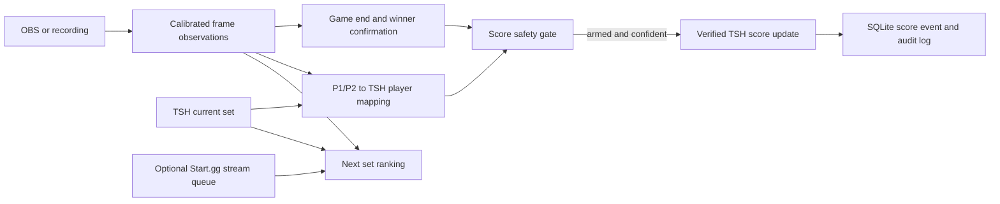

# Smash AutoScore: feature inventory and remaining work

_Repository review: 2026-10-02. Describes the code on `main` through commit `a756153`._

## What the project does today

Smash AutoScore is a local web app for a Smash Ultimate broadcast operator. It reads a video source and Tournament Stream Helper (TSH), tries to identify the in-game P1/P2 slots and the winner, maps that slot to the correct TSH player, and can add one point. The operator can always score manually. Automatic scoring starts disarmed. A demo TSH adapter and recording tools allow rehearsals without touching a live scoreboard.

The current winner method is deterministic computer vision. It checks a gold first-place numeral region plus a red or blue first-place badge and an opposite-colored second-place badge on the results screen. It identifies a **slot** (`P1` or `P2`), then the separate mapping engine identifies the **competitor**. It does not require the words `P1 WINS` or `P2 WINS`; explicit slot text remains an optional OCR fallback. A missing or conflicting result can remain unknown.

## Feature inventory

“Tested” below distinguishes real recording tests from automated tests using simulated services. A feature being implemented does not imply it has been proven safe on a live production setup.

| Area | What is implemented | Validation and present limit |
| --- | --- | --- |
| Local dashboard and API | FastAPI dashboard at `127.0.0.1:8765` shows the set, score, connections, state, mapping evidence, winner, event log, performance, calibration, and rehearsal checklist. Buttons cover scoring, undo, arm/disarm, mapping override, player swap, and next set actions. | Dashboard/API routes have automated tests. Operator usability during an actual event has not been assessed. |
| TSH set reading | Reads current set ID, names, scores, colors, best-of, and candidate sets through a TSH web adapter. Demo mode supplies a disposable in-memory set. | TSH route responses have mock tests. No installed TSH version has been exercised live on this computer. TSH routes are undocumented implementation details. |
| Manual scoring and undo | Adds a point to either TSH side; undo checks the current set and expected score before reversing the latest applied transaction. | Automated tests cover demo behavior and mocked routes. Live TSH correction needs a disposable-scoreboard test. |
| Automatic score transaction | Requires the app to be armed, a confirmed end, a confirmed winner slot, and a confident slot-to-player mapping. It writes one point, reads TSH back, logs before/after scores, and disarms on an uncertain write. | Automated tests and recorded-video rehearsal through the demo adapter passed. Live TSH write/readback remains untested. |
| Duplicate protection | Uses set ID plus game generation as an event ID; SQLite makes a second insert for the same event impossible. A result screen stays locked until a new game is observed. | Persistent-result and two-game rehearsal tests passed. Restarting the app during the same set needs hardening because game generation is currently in memory. |
| Game lifecycle | Tracks waiting, starting, active game, end candidate, confirmed result, updated score, post-game, and set complete. End and winner are confirmed independently over multiple observations. A new game needs stable gameplay and a post-game lockout. | Unit tests cover noise, lockout, reset, and generation changes; three selected game windows were replayed. The gameplay HUD dependency described below needs improvement. |
| Game-end detection | Uses calibrated visual results layout, with optional `GAME SET` OCR evidence. A confirmed end carries confidence and evidence. | All three labeled result windows in one recording were found at 5 samples/second. A brief result was missed at 2.5 samples/second. No full-recording false-positive survey yet. |
| Winner detection | Checks first- and second-place badge colors with the first-place numeral; returns P1, P2, or unknown. Text OCR is a fallback when available. Winner is confirmed across samples. | Three labeled windows: P1, P1, P2, all correct. This covers one 16:9 broadcast layout; no SD, timeout, broad overlay, or full-roster evaluation. Confidence values are rule outputs, not measured probabilities. |
| P1/P2 competitor mapping | Compares two hypotheses: P1=TSH left and P1=TSH right. Evidence can include OCR tags/aliases, HUD colors, character usage, and previous mapping. Conflicting evidence caps confidence. Operator override is available. | Mapping unit tests pass. The recording rehearsal used a verified P1-left override, so it did not independently prove automatic mapping on that footage. |
| Player-side swap | Suggests a swap when mapping says sides are reversed. AUTO mode requires multiple strong signals and verifies the TSH swap result; manual swap is available. | Mock tests only. Must be tested against the installed TSH version. |
| HUD character recognition | Operator saves local P1/P2 portrait templates. Grayscale template comparison requires an absolute match, a margin over alternatives, and three votes in five samples. History resets on a new game. | Donkey Kong, Little Mac, Joker, Pyra/Mythra, and Ridley local templates have been used during development. Documented quantitative character replay covers DK/Little Mac/Joker in one layout; unknown frames were common, with no wrong labels in the cited 72 samples. Local PNG templates are ignored by Git. |
| Player information | Stores local aliases, Supermajor IDs, and character-use overrides in SQLite. Optional Supermajor lookup fetches a public page by explicitly supplied ID and calculates distributions from reported game counts, with a seven-day cache by default. | Parser, fallback, cache, and failure tests exist; a public page was checked during development. This is an undocumented page format and can change. Start.gg IDs are not treated as Supermajor IDs. |
| Start.gg stream queue | Optional token and tournament/stream settings add stream-assigned set IDs to next-set ranking. | Provider code exists; no dedicated provider test or live credential check was found in this review. |
| Next set suggestions | Ranks TSH candidates using tags, character history, and optional stream assignment. Defaults to SUGGEST. AUTO has confidence, margin, post-set delay, and fresh-game requirements; the operator can load or dismiss a candidate. | Unit/demo tests exist. A complete real set through TSH and OBS, including next-set load, has not been rehearsed. |
| OBS and recorded video | OBS WebSocket screenshot source and local recording source feed a video worker. Capture errors disarm scoring; the worker retries. OCR, HUD color, and character sampling have separate intervals. | OBS screenshot and failure behavior have mock tests. Recorded video has been used. No running OBS installation was exercised live. |
| Calibration | Dashboard can draw normalized regions, save named profiles, show a current frame, and test OCR, color, character, or result regions. | Works in code and tests. Results defaults were tuned on one broadcast; every different layout needs calibration and replay. |
| Replay tools | `analyze_video` exports character CSV or game JSON/CSV. `rehearse_video` sends selected recording windows through vision, state, mapping, and a disposable TSH score path. Demo mode also accepts structured observations over an API endpoint. | Three selected result windows and two consecutive game scores were replayed. Rehearsal with actual TSH/OBS is still pending. |
| Winner diagnostics and audit | Optional local frame, crop, and JSON capture for candidate, confirmed, result, unknown, and manual decisions. Manual disagreement logs a prediction error. SQLite stores events and score transactions. | Unit tests pass. Diagnostic captures are local and ignored by Git; no reviewed correction dataset has been assembled. |
| Performance telemetry | Dashboard reports capture/analysis FPS, frame and detector time, game-state time, CPU, RAM, dropped frames, and TSH/OBS round-trip times when available. | A 35-second offline replay reported about 76.7 MB RAM, 2.06 ms average CV/frame, and 341.5% of one CPU core largely due to random high-resolution seeks/decode. These are not live OBS or TSH measurements. |
| Tests and development checks | Python tests cover identity, vision, state, character templates, Supermajor, API, TSH/OBS mocks, recovery, and replay input. Ruff and mypy checks are configured. | As of this review: 41 tests pass; Ruff and mypy pass. External services and other broadcast layouts remain outside those automated tests. |

## Evidence from the supplied recording

The supplied file is a roughly 3-hour-41-minute Smash tournament recording. **Only selected windows were labeled and evaluated**, totaling 85 seconds around three game ends:

| Recording window | Observed end | Winner slot | Outcome at 0.2-second sampling |
| --- | --- | --- | --- |
| 14:50–15:15 | 15:07.4 | P1 | Detected and correct |
| 20:30–20:55 | 20:49.6 | P1 | Detected and correct |
| 44:30–45:05 | 44:58.6 | P2 | Detected and correct |

In these selected windows: 3/3 known ends detected, 3/3 winners correct, 0 observed wrong winners, 0 extra end events, and 0 abstentions. Confirmation took about 0.2 seconds after the first qualifying result sample. These numbers do not estimate accuracy on a full tournament. At 0.4-second sampling, one brief result was missed. In the disposable-scoreboard rehearsal, two consecutive P1 wins changed 0–0 → 1–0 → 2–0 with distinct event IDs; the separate P2 win changed 0–0 → 0–1.

## What still needs to be done

### Priority 1 — close scoring safety gaps

1. **Persist game identity across restarts.** The SQLite score event ID includes the in-memory game generation. If the app restarts during the same TSH set, a later legitimate game can reuse an old ID and be refused. Store or recover the per-set generation, reconcile the current TSH score and the last transaction on startup, and test restart before/after a result and before the next game.
2. **Recognize gameplay without two character templates.** The live state machine currently requires `hud_visible`, and that flag is set when both character portraits are recognized. A new layout, missing templates, or an obscured portrait can prevent the first game or next game from starting. Add an independent calibrated HUD/gameplay signal, then test missing templates, a character switch, a ditto, and post-game transitions.
3. **Recheck mapping during each game.** Previous mapping and manual override can carry across games. Test side changes, swapped TSH players, random tags, stale HUD colors, and conflicting evidence. Decide when old mapping must expire or require a new operator confirmation before an automatic point.
4. **Make uncertain TSH writes recoverable.** Keep the current disarm-on-uncertainty rule. Add an explicit operator reconciliation flow that compares TSH's actual score with the pending event and records whether the point applied, was retried safely, or was abandoned. Test timeouts both before and after TSH applies a point.

### Priority 2 — establish accuracy on varied footage

5. **Build a labeled evaluation set.** Collect complete games and non-game intervals across multiple broadcasts, stages, transitions, skins, mirrored layouts, character switches, dittos, SDs, and timeouts. Record end time, winner slot, and uncertain cases; reserve held-out footage for evaluation. Report end recall, extra ends per hour, winner correct/wrong/unknown rates, duplicate score rate, and latency.
6. **Validate or revise the result detector.** Current gold and badge thresholds and the 16:9 geometry are tailored to one layout. Measure which variants fail, expose any needed tuning through calibration, and add an independent result signal only if it improves the held-out wrong-winner rate. If signals conflict, return unknown.
7. **Test low sampling rates and performance.** Brief results can be missed at 2.5 FPS. Measure capture and analysis cadence on the intended tournament PC, account for OBS screenshot overhead, and decide the minimum reliable sampling rate. Offline random-seek CPU results cannot substitute for live measurements.

### Priority 3 — validate real integrations and operator workflow

8. **Test the installed TSH version on a disposable scoreboard.** Record its version and verify set, players, scores, colors, candidate sets, increment, undo, swap, load, readback, closed/restarted server, invalid state, and timeout. Update the adapter if actual responses differ from mocks.
9. **Run OBS WebSocket live.** Check the selected source, resize/latency, source rename or removal, disconnect/restart, and recovery. Verify the app disarms on capture failure and that calibration matches the actual broadcast output.
10. **Rehearse a complete set end to end.** With a disposable TSH set and OBS scene, keep auto scoring disarmed for initial comparisons, then test armed scoring, multiple games, character switch, ambiguous winner/manual score, undo, set completion, next-set suggestion, and load. Use the [rehearsal checklist](rehearsal.md) and record actual outcomes.
11. **Check optional data sources in the real setup.** Test Start.gg stream queue with credentials if it will be used. Recheck the Supermajor page format and confirm supplied IDs and character distributions with the operator. Neither source should be required for manual scoring.

### Priority 4 — polish after safety and integration evidence

12. **Improve dashboard clarity.** Show one consistent score-gate reason, current mapping source, and clear recovery steps for unknown winners and uncertain score writes. The dashboard currently makes several independent status requests every two seconds; consolidate them before optimizing further.
13. **Expand character template coverage.** Capture examples for the actual event roster and lighting/overlay conditions, then measure wrong-label and unknown rates. Character probabilities should remain supporting evidence, especially for dittos.
14. **Package the operator setup.** Provide a short first-run walkthrough, calibration backup/export, and a release checklist that records the verified TSH/OBS versions, Python environment, and rehearsal results.

## Practical next milestone

Start with **restart-safe event IDs and gameplay recognition independent of character templates**, then use a disposable TSH scoreboard and OBS scene for the first live rehearsal. Those two code issues can affect ordinary scoring even when the result detector is correct. Wider accuracy claims should wait for a labeled, held-out footage set. Until then, keep automatic scoring disarmed at live events and use the manual controls when evidence is incomplete.

## Where to read more

- [README](../README.md): setup, configuration, architecture, and current recording metrics.
- [Live rehearsal guide](rehearsal.md): routes, commands, and operator checklist.
- `src/smash_auto_score/`: application, detectors, state, controller, and integrations.
- `tests/`: automated behavior and failure cases.
